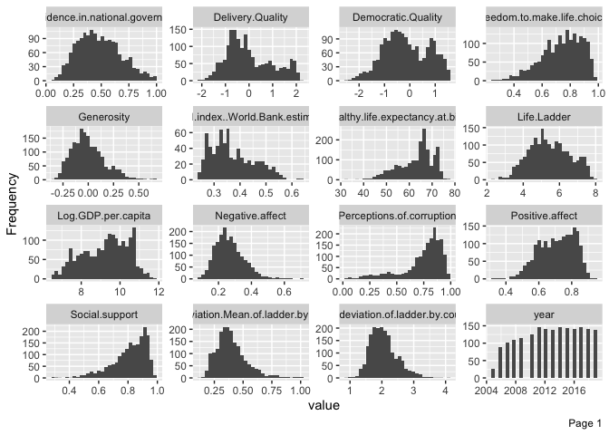
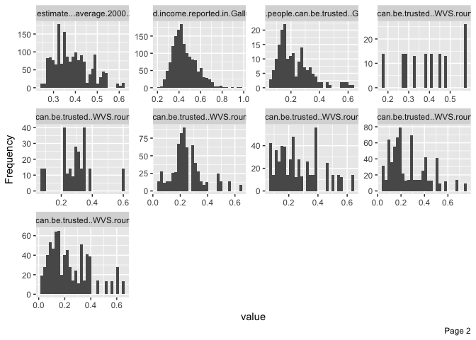
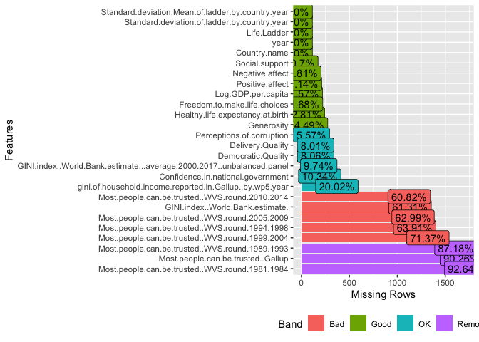
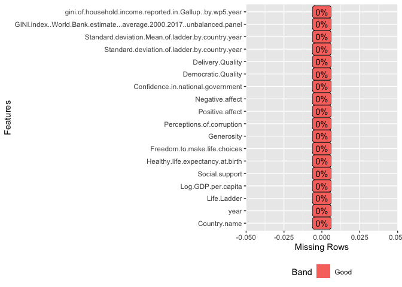
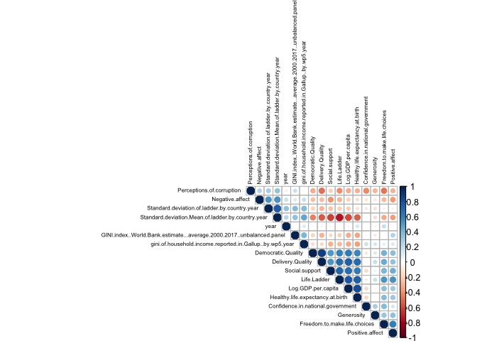
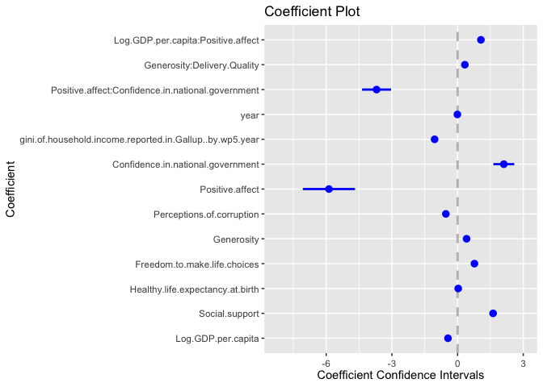
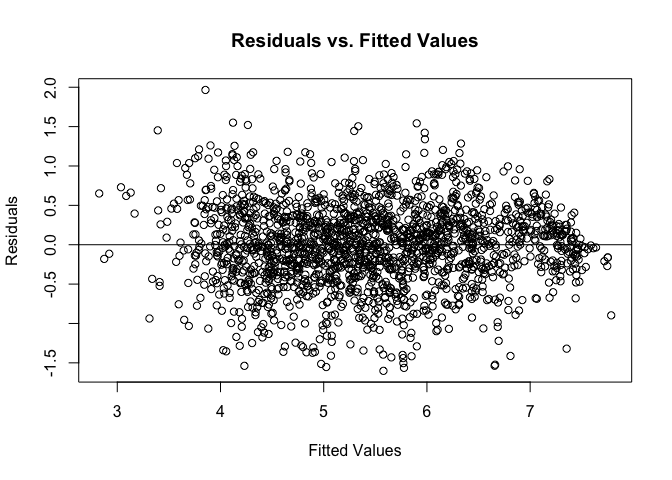
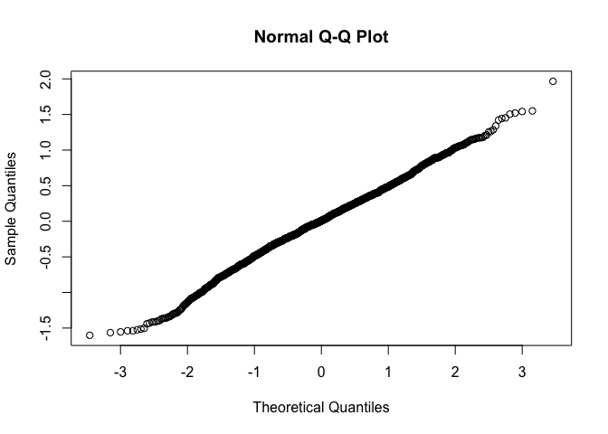

# Analysis Overview
This data comes from the 2020 World Happiness Report, a survey that ranks 156 countries on how happy their citizens perceive themselves to be. The most important source of data from the Report is the Gallup World Poll, which surveys citizens' life evaluations, leading to the happiness ranking. 

The report can be found [here](https://worldhappiness.report/ed/2020/).

### Goal of Analysis
The goal of this analysis is to determine which factors have a statistically significant impact on a country's happiness, using the variable, Life Ladder, as y. This analysis is to be used by the World Health Organization (WHO) to better understand why and help countries who may have low levels of happiness. This analysis should provide insight to the WHO so that they can institute new policies that might, in the long run, affect happiness. It is crucial that this analysis is reusable in order for the audience to use the knowledge. 

### Loading Data into R

```r
happy<-read.csv("HappyData.csv")
```

### Loading in Packages

```r
library(pacman)
pacman::p_load(dplyr, coefplot, DataExplorer)
```
* The dplyr package allows for manipulation of variables, such as selecting variables to drop from the analysis.
* The DataExplorer package gives the ability to introduce the data and create graphs to easily visualize the data.
* The coefplot is used to visualize the confidence intervals of the coefficients in the regression model.

# Description of Data
There are 1848 observations with 26 variables.A full dictionary of the variables can be found [here](https://happiness-report.s3.amazonaws.com/2020/WHR20_Ch2_Statistical_Appendix.pdf).

* __The Happiness Score__ or subjective well-being (variable = Life.Ladder)
 * __Country name__ study of 156 countries.
 * __Year__ ranging from 2005 to 2019.
 * __GDP per capita__ (variable = Log gdp per capita)
 * __Healthy Life Expectancy__ (variable = Healthy life expectancy at birth)
 * __Social Support__ or having someone to count on in times of trouble (variable = Social Support)
 * __Freedom__ to make life choices (variable = Freedom to make life choices)
 * __Generosity__ or donating money to charity in the past month (variable = Generosity)
 * __Corruption Perception__, both within government and businesses (variable = Perceptions of Corruption)
 * __Positive Affect__ (average of happiness, laugh, and enjoyment)
 * __Negative Affect__ (average of worry, sadness, anger)
 * __GINI of household income__ (variable = giniIncGallup)
 * __GINI index__ from the World Bank (variable = giniIncWB)
 * __Average GINI index__ from the World Bank (variable = giniIncWBavg)
 * __Standard.deviation.mean.of.ladder.by.country.year__
 * __Standard.deviation.mean.of.ladder.year.by.country.year__
 * __Democratic.Quality__
 * __Delivery.Quality__ 
 * __GINI.index..World.Bank.estimate__
 * __Most.people.can.be.trusted..WVS.round.1981.1984__
 * __Most.people.can.be.trusted..WVS.round.1989.1993__
 * __Most.people.can.be.trusted..WVS.round.1994.1998__
 * __Most.people.can.be.trusted..WVS.round.1999.2004__
 * __Most.people.can.be.trusted..WVS.round.2005.2009__
 * __Most.people.can.be.trusted..WVS.round.2010.2014__
 * __Most.people.can.be.trusted..Gallup__
 
## Introduction of Data 

```r
head(happy)[1:5]
```

```
##   Country.name year Life.Ladder Log.GDP.per.capita Social.support
## 1  Afghanistan 2008    3.723590           7.144916      0.4506623
## 2  Afghanistan 2009    4.401778           7.314788      0.5523084
## 3  Afghanistan 2010    4.758381           7.421525      0.5390752
## 4  Afghanistan 2011    3.831719           7.394349      0.5211036
## 5  Afghanistan 2012    3.782938           7.480296      0.5206367
## 6  Afghanistan 2013    3.572100           7.499845      0.4835519
```

```r
tail(happy)[1:5]
```

```
##      Country.name year Life.Ladder Log.GDP.per.capita Social.support
## 1843     Zimbabwe 2014    4.184451           7.826639      0.7658390
## 1844     Zimbabwe 2015    3.703191           7.827643      0.7358003
## 1845     Zimbabwe 2016    3.735400           7.819675      0.7684254
## 1846     Zimbabwe 2017    3.638300           7.851042      0.7541471
## 1847     Zimbabwe 2018    3.616480           7.896704      0.7753885
## 1848     Zimbabwe 2019    2.693523           7.850442      0.7591623
```
The head and tails of the data give the first and last six observations for the first five variables in the dataset. As you can see, there are multiple years recorded for each country.


```r
introduce(happy)
```

```
##   rows columns discrete_columns continuous_columns all_missing_columns
## 1 1848      26                1                 25                   0
##   total_missing_values complete_rows total_observations memory_usage
## 1                12297             3              48048       388800
```
As mentioned above, there are 1848 observations from 26 variables, with 12,297 missing values. The missing values will be addressed further along in this analysis.


```r
plot_histogram(happy)
```

<!-- --><!-- -->

These histograms give insight quick visual insight into the remaining variables. It is clear that some of the variables are skewed, such as "Perceptions.of.corruption" and "Social.support", meaning the distribution of these variables varies from a normal distribution. 

## Missing Data

```r
plot_missing(happy)
```

<!-- -->

As you can see from the chart above and the data summary, there are 12,297 missing values in this data set.The plot above shows the percentages of missing data for each variable, determining if it is okay to keep it in, or if it should be removed.

The Happiness Report acknowledges these missing values and says they did not use missing value to draw results from the happiness rankings and the regression outputs. However, they did make use of imputation in decomposing a country's average ladder score into components explained by 6 determinants (GDP per person, healthy life expectancy, social support, perceived freedom, generosity, and perception of corruption).

A decision must be made on whether to keep or remove these variables with high percentages of missing values in the analysis. I am going to remove all variables with "Bad" or "Remove" labels.

# Cleaning the Data
The code below removes the 8 variables with missing data considered "Bad" or "Remove" from the dataset.

```r
library(dplyr)
happy<-select(happy, -Most.people.can.be.trusted..WVS.round.2010.2014, -GINI.index..World.Bank.estimate., -Most.people.can.be.trusted..WVS.round.2005.2009, -Most.people.can.be.trusted..WVS.round.1994.1998, -Most.people.can.be.trusted..WVS.round.1999.2004, -Most.people.can.be.trusted..WVS.round.1989.1993, -Most.people.can.be.trusted..Gallup, -Most.people.can.be.trusted..WVS.round.1981.1984)
```


```r
introduce(happy)
```

```
##   rows columns discrete_columns continuous_columns all_missing_columns
## 1 1848      18                1                 17                   0
##   total_missing_values complete_rows total_observations memory_usage
## 1                 1385          1083              33264       268416
```
Now there are 1385 missing values. 

## Imputation of Variables
In order to account for the 1385 missing values, I will impute each variable with the median for each variable. By choosing median over mean, it  will limit the influence of outliers. After the imputation, 


Here is an example of the process for imputation for the variable "Democratic.Quality". The same process was repeated across the 13 variables that had any missing observations.

```r
#imputation for Democratic.Quality
summary(happy$Democratic.Quality)
```

```
##    Min. 1st Qu.  Median    Mean 3rd Qu.    Max.    NA's 
## -2.4483 -0.7885 -0.2259 -0.1350  0.6531  1.5825     149
```

```r
happy$M_Democratic.Quality<-as.factor(ifelse(is.na(happy$Democratic.Quality), 1, 0))
happy$Democratic.Quality[is.na(happy$Democratic.Quality)]<-median(happy$Democratic.Quality, na.rm=TRUE)
summary(happy$Democratic.Quality)
```

```
##    Min. 1st Qu.  Median    Mean 3rd Qu.    Max. 
## -2.4483 -0.7350 -0.2259 -0.1423  0.5428  1.5825
```


Now, we can remove the variables created for the imputation containing the median. 


As you can see, now there are zero missing observations in the dataset.

```r
plot_missing(happy)
```

<!-- -->

With no missing data, we can look at the correlation between variables. 


```r
M<-cor(happy_numeric2, use = "complete.obs")
library("corrplot")
```

```
## corrplot 0.84 loaded
```

```r
corrplot(M, type = "upper", tl.pos = "td",
         method = "circle", tl.cex = 0.5, tl.col = 'black',
         order = "hclust", diag = TRUE)
```

<!-- -->

The correlation plot is an easy way to visualize associations between variables. Strong positive associations are indicated by large dark blue dots and strong negative associations are indicated by large dark red dots.

From the correlation plot, we can determine that there is a strong positive associations between the "standard.deviation.of.ladder.by.country.year" and the "standard.deviation.mean.of.ladder.by.country.year" and a strong negative association between "standard.deviation.mean.of.ladder.by.country.year" and "Life.ladder." So, I will not include  will not include either "standard.deviation.mean.of.ladder.by.country.year" or "standard.deviation.of.ladder.by.country.year" in the regression analysis because of its strong association with the target variable, which could lead to skewed results. It makes sense that these two variables would be correlated because the nature of the variable is directly related to the Ladder variable.


```r
happy<-select(happy, -Standard.deviation.of.ladder.by.country.year, -Standard.deviation.Mean.of.ladder.by.country.year)
```

# The Regression Model

```r
happy.reg<-lm(Life.Ladder~Log.GDP.per.capita+Social.support+Healthy.life.expectancy.at.birth+Freedom.to.make.life.choices+Generosity+Perceptions.of.corruption+Positive.affect+Confidence.in.national.government+gini.of.household.income.reported.in.Gallup..by.wp5.year+Positive.affect:Confidence.in.national.government+Generosity:Delivery.Quality+Log.GDP.per.capita:Positive.affect+year-Country.name, data=happy)
summary(happy.reg)
```

```
## 
## Call:
## lm(formula = Life.Ladder ~ Log.GDP.per.capita + Social.support + 
##     Healthy.life.expectancy.at.birth + Freedom.to.make.life.choices + 
##     Generosity + Perceptions.of.corruption + Positive.affect + 
##     Confidence.in.national.government + gini.of.household.income.reported.in.Gallup..by.wp5.year + 
##     Positive.affect:Confidence.in.national.government + Generosity:Delivery.Quality + 
##     Log.GDP.per.capita:Positive.affect + year - Country.name, 
##     data = happy)
## 
## Residuals:
##      Min       1Q   Median       3Q      Max 
## -1.60165 -0.30889  0.00491  0.33312  1.96549 
## 
## Coefficients:
##                                                           Estimate Std. Error
## (Intercept)                                              21.872538   6.649001
## Log.GDP.per.capita                                       -0.439490   0.089261
## Social.support                                            1.620168   0.156891
## Healthy.life.expectancy.at.birth                          0.028397   0.003045
## Freedom.to.make.life.choices                              0.769667   0.134978
## Generosity                                                0.411019   0.088383
## Perceptions.of.corruption                                -0.536434   0.090389
## Positive.affect                                          -5.874228   1.190338
## Confidence.in.national.government                         2.110861   0.476826
## gini.of.household.income.reported.in.Gallup..by.wp5.year -1.049087   0.146153
## year                                                     -0.008834   0.003291
## Positive.affect:Confidence.in.national.government        -3.700270   0.660447
## Generosity:Delivery.Quality                               0.331489   0.085651
## Log.GDP.per.capita:Positive.affect                        1.064768   0.122140
##                                                          t value Pr(>|t|)    
## (Intercept)                                                3.290 0.001022 ** 
## Log.GDP.per.capita                                        -4.924 9.26e-07 ***
## Social.support                                            10.327  < 2e-16 ***
## Healthy.life.expectancy.at.birth                           9.327  < 2e-16 ***
## Freedom.to.make.life.choices                               5.702 1.38e-08 ***
## Generosity                                                 4.650 3.55e-06 ***
## Perceptions.of.corruption                                 -5.935 3.51e-09 ***
## Positive.affect                                           -4.935 8.74e-07 ***
## Confidence.in.national.government                          4.427 1.01e-05 ***
## gini.of.household.income.reported.in.Gallup..by.wp5.year  -7.178 1.02e-12 ***
## year                                                      -2.684 0.007332 ** 
## Positive.affect:Confidence.in.national.government         -5.603 2.43e-08 ***
## Generosity:Delivery.Quality                                3.870 0.000113 ***
## Log.GDP.per.capita:Positive.affect                         8.718  < 2e-16 ***
## ---
## Signif. codes:  0 '***' 0.001 '**' 0.01 '*' 0.05 '.' 0.1 ' ' 1
## 
## Residual standard error: 0.5184 on 1834 degrees of freedom
## Multiple R-squared:  0.7869,	Adjusted R-squared:  0.7854 
## F-statistic: 520.8 on 13 and 1834 DF,  p-value: < 2.2e-16
```
The explanatory regression model includes 12 variables and 3 interaction variables.  All of the variables included in the model are significant with p-values above alpha = .05.


# Visualizations of Model

```r
coefplot(happy.reg, xlab = "Coefficient Confidence Intervals", varnames=NULL, intercept=FALSE)
```

<!-- -->

__Coefficient Plot Analysis:__
The coefficient plot above displays the point estimates for each variable in the model and their confidence intervals.For example, if we wanted to interpret the coefficient of "Social.Support" we could say the mean of the happiness score (Life.Ladder variable) increases by 1.665423 points given a one-unit increase in the Social.Support score while holding other variables in the model constant.

# Justification of Model

__Slope interpretation:__
If all the variables in the model are scored as 0, the Life.Ladder, or happiness, score is estimated to be 4.159059 (on a 0-10 scale).

__Model significance test:__

  $H0: β1=β2=β3=β4=β5=β6=β7=β8=β9=β10=β11=β12=β13=0$
  
  Ha: at least one $βk≠0$

The F-statistic is 561.7, with degrees of freedom k=12 and n−(k+1)=1835.
The p-value is < 2.2e-16. 

There is significant evidence at any reasonable level of significance to conclude that any of the variables in the model are significant linear predictors of the happiness level of a country.

__$R^2$  Interpretation:__
An $R^2$ score of 0.786 (Adjusted R-squared: 0.7846 accounts for the sample size and model parameters) implies that 78.6% of the observed variation in the happiness score of countries are accounted for by the model that includes a combination of the 13 variables in the model.

## Plot of Assumptions
Residuals vs. Fitted Values:
<!-- -->

The plot of the Residuals vs. Fitted Values above shows the residuals randomly scattered around the 0 line, suggesting that the assumption that the relationship is linear is accurate and that the variances of the error terms are equal. The graph does not show any major outliers.

<!-- -->

This Normal Q-Q Plot of the residuals appears there is normal distribution in the model, with some slight strays for normalcy in tails of the distribution.

# What does this mean for the World Health Organization?

The model created in the report is significant, as well as all of the predictor variables included. By determining the most significant factors that influence the Life.Ladder score, the World Health Organization can determine the range of happiness scores by country and explore options for improvement, especially within the variables that have the highest significant influence on the Life.Ladder score. 

For example, using the results from the model, the WHO can determine how country's may improve their citizens' confidence in the national government, which if the score improved by 1, could lead to a 2.359119 increase in a country's happiness score, which is a combination of their citizen's perceived happiness. The WHO can explore the variables in the model for each country to gain insight to the country's so that they can institute new policies that might, in the long run, affect happiness.
